```{r setup, include=FALSE}
knitr::opts_chunk$set(echo = TRUE)
```

# Introduction

Sport analytics has become popular in recent decades as sports organizations have turned to historical data to try and predict future outcomes. For this assignment, our group reviewed a baseball data set detailing the performance of a variety of professional teams from the year 1871 to 2006. The goal was to produce a model that can accurately predict the number of wins a team will have in a season based on their performance across a variety of metrics related to hitting and pitching.

We first explored the data to better understand the distribution of our data and identify potential transformations that may be needed. With insights from our data exploration, we applied various transformations and imputations to prepare the data for modeling. We fit four different linear models, then evaluated them to determine the model that offers the best accuracy and completeness.

# Data Exploration

Our data exploration focused on (i) the distribution of variables, (ii) correlations across variables, and (iii) the presence of NAs in the data.

On the first item, we started by exploring the distribution of our target variable, number of wins (see `Figure 1`). The `TARGET_WINS` column follows a relatively normal distribution. This will be important when deciding which transformation method to use. Since TARGET_WINS will be our dependent variable, using a Box-Cox transformation may not be the best method since our dependent variable already follows a normal distribution.

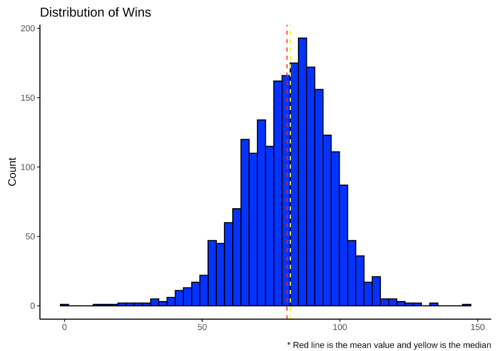

We also examined the distribution of the remaining variables (see `Figure 2`). Many of the features exhibit positive skewness. In particular, `TEAM_PITCHING_BB`, `TEAM_PITCHING_H`, `TEAM_PITCHING_SO`, and `TEAM_FIELDING_E` have distinct right-skewness. By contrast, `TEAM_BATTING_SO`, `TEAM_BATTING_2B`, and `TEAM_FIELDING_DP` appear to show a normal distribution. Overall, it appears that the data may benefit from some kind of transformation that can address non-normality, such as log transformation.

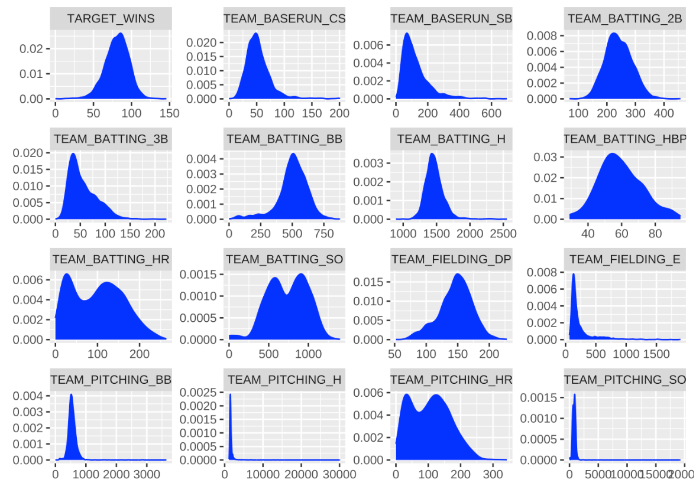

Next, we examined the relationship across variables. We started with scatter plots that examine the relationship between each independent variable and our target variable (number of wins; see `Figure 3`). We do see a number of variables that appear to share a linear relationship with the target, especially `TEAM_BATTING_BB`, `TEAM_BATTING_H`, and `TEAM_BATTING_2B`. However, we see again that some of the skewness and non-normality appears to obscure variables' relationship with number of wins.

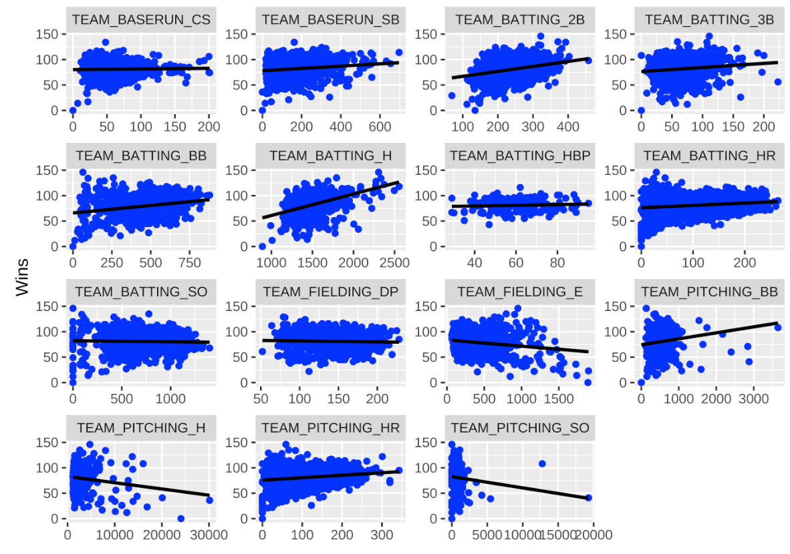

We also examined pairwise correlation across all predictor variables (see `Figure 4`). The goal here was to identify potential multicollinearity, which can distort diagnostics and sometimes produce spurious predictions. We identified a number of variables that appear highly correlated, such as `TEAM_BATTING_H` / `TEAM_PITCHING_H`, `TEAM_BATTING_HR` / `TEAM_PITCHING_HR`, `TEAM_BATTING_BB` / `TEAM_PITCHING_BB` and `TEAM_BATTING_SO` / `TEAM_PITCHING_SO`. These correlations indicate that, in our modeling stage, we may need to conside removing some variables to avoid the problems presented by multicollinearity.

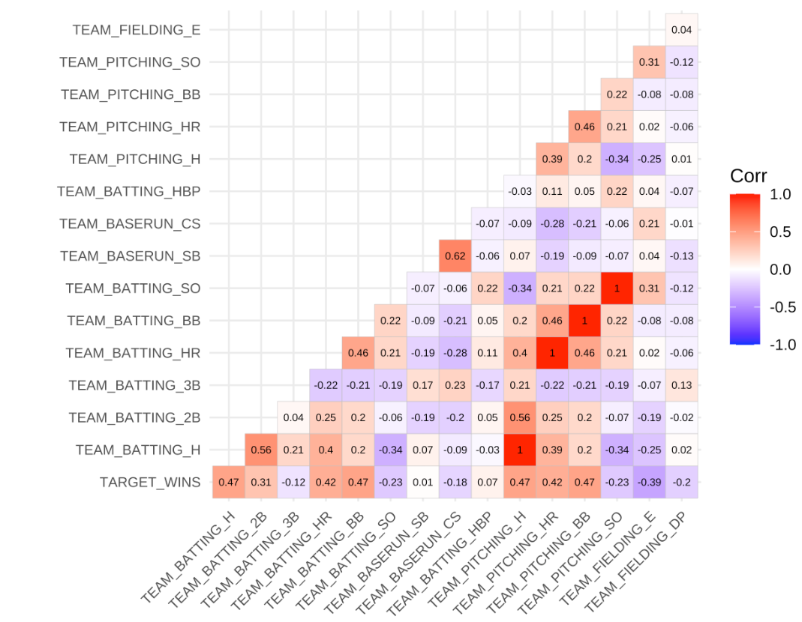

Finally, we examined missing values in our data. The table (see `Figure 5`) below shows the percentage of records with NAs for the six features where we identified NAs. Most notable was the `TEAM_BATTING_HBP` variable, for which 92% of the observations were missing. While imputation can address a certain degree of missing values, we reasoned that such a high percentage of missing values would likely introduce some distortion to predictions. So, we decided to remove this variable from all future steps. For the other five variables with missing values, we found the percentages more reasonable, so we decided to keep them. Still, this identified the need for imputation to handle NAs.

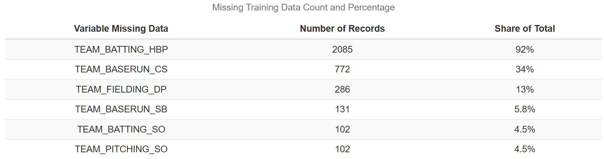

# Data Preparation

After examining our data, we decided to perform a log transformation of the training data. Before we transformed the data, we noticed that singles (1B) were not represented in the dataset. Therefore, we created a new variable by subtracting the batting columns for home runs, triples, and doubles from the total amount of hits represented by the `TEAM_BATTING_H` column. Next, we evaluated what the new variable’s correlation coefficient was with `TARGET_WINS.` It had the 4th-highest coefficient with 0.22, behind batting hits (0.39), batting doubles (0.29), and batting walks (0.23). In addition, we noticed that the correlation coefficients had decreased for both the dependent and independent variables. Thus, imputing the data and creating a new variable may have helped decrease multicollinearity in the train data. The updated correlation matrix is shown in see `Figure 6`.

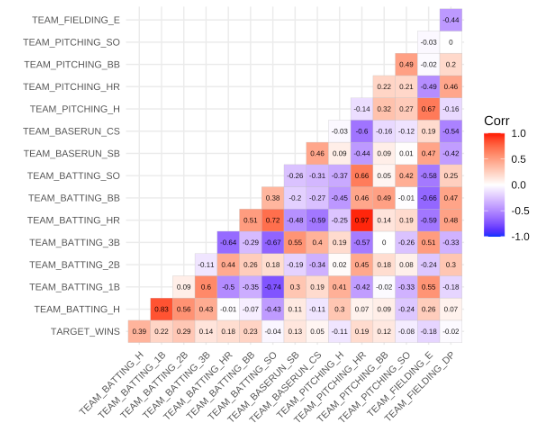

Next, we decided to use a log-transformation method to address non-normal distribution and positive skewness that was apparent in some of the independent variables for the training data. Since transforming the variables before imputing missing values helps preserve the relationships between the variables in the regression model, we decided to transform the data first before using our KNN imputation method. After log-transforming the data, there were a considerable amount of infinite values created. To address this, we turned those values into NA values and imputed the NA values. We created density, histogram, and point plots to re-assess how the log transformation changed the distribution for each independent variable, as well as their respective relationships with `TARGET_WINS.` Variables that previously showed a distinct right skewness (`TEAM_PITCHING_BB`, `TEAM_PITCHING_SO`, and `TEAM_FIELDING_E`) showed improvement in their distribution, with `TEAM_PITCHING_BB` showing the biggest improvement and `TEAM_PITCHING_H` not showing much change from its previous right-skewed distribution. Because we log-transformed and imputed the training data, we did the same for the test data to ensure that the model using the log-transformed train data would be able to make accurate predictions with test data that was also log-transformed. The updated distributions are detailed in `Figure 7`.

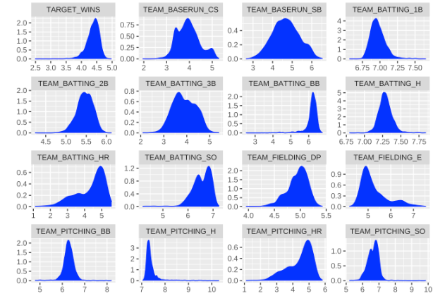

# Build Models

To build our models, we decided to use two different feature selection techniques on the imputed train set and log-transformed imputed train set. The first technique we used involved using the findCorrelation function from the caret package. The purpose of this function is to remove independent variables that had high correlation coefficients with other variables, setting the cutoff threshold at 50% and keeping the remaining variables that did not reach the 50% cutoff. 

The second feature selection technique was used from the caret package. The method is called the Recursive Feature Elimination, which applies a backward selection process to find the optimal combination of features. It builds a model based on all features and calculates the importance of each feature in the model, ranking the features and removing the variables with the least importance iteratively based on model evaluation metrics, such as RMSE and accuracy. This process continues until there is a small subset of features retained in the model. 

The first model used the findCorrelation function on the imputed training data (see residual plots in `Figure 8` and `Figure 9`). The initial results produced an Adjusted R-squared of 0.1857 and a residual standard error of 14.22. These metrics indicate that the model did not perform well, as only 18.57% of the variance in wins could be explained by the variables in the model and 14.22 represents the model’s error when fitting the observed data. We identified two variables, TEAM_PITCHING_H and TEAM_PITCHING_BB, that had p-values greater than 0.05, which indicates that each feature does not have statistical significance when explaining the variance of wins. We removed both variables and re-ran the model. The revised model produced roughly the same results. However, the F-statistic increased from 75.12 to 104.7, which may indicate that removing the two variables with high p-values helped improve the ability of the predictors in the model to explain the variability in wins. The Residual vs Fitted Values plot displayed a cluster of data points around the zero thresholds, with other data points that appear randomly scattered. The histogram plot displays a normal distribution with its center near zero, and the Normal QQ plot shows most of the data points on the regression line with slight tail deviations on each end.

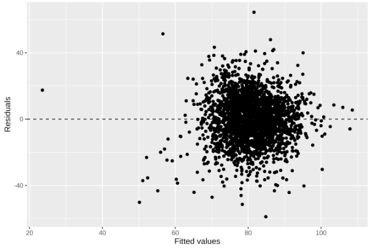

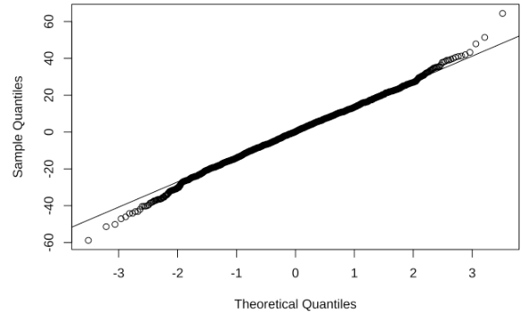

The second model used the same feature selection technique as the first model, but we used the log-transformed imputed training dataset (see residual plots in `Figure 10` and `Figure 11`). While the model’s Adjusted R-squared slightly improved with a value of 18.84%, its Residual Standard Error was significantly smaller with a value of 0.199. We identified one variable, TEAM_BASERUN_CS, that had a p-value greater than 0.05. After removing the variable and re-running the model, there was a slight improvement in the Adjusted R-squared (18.87%) and no change in the Residual Standard Error. The F-statistic increased from 89.03 to 106.8. The Residual vs Fitted Values plot shows a cluster of data points around zero towards the right of the plot, with slightly more scattered data points than the first model. The histogram plot appears to show slight skewness to the left. The Normal QQ plot shows a distinct left tail deviation from the line, which indicates there is skewness.

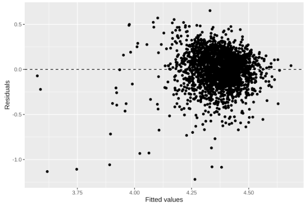

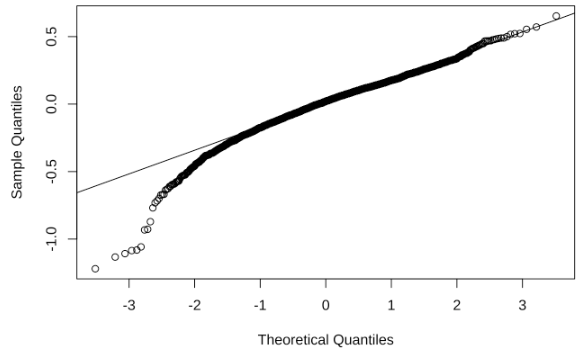

The third model utilized the Recursive Feature Elimination on the imputed training set (see residual plots in `Figure 12` and `Figure 13`). The results from using this technique showed improvement in the Adjusted R-squared, with a value of 27.93%. However, the Residual Standard Error was comparable to the first model, with a value of 13.37. The plots followed a similar pattern to the first two models. However, the data points in the Residual vs. Fitted Values plot appeared to be slightly less clustered, there was a defined normal distribution in the histogram plot with its center near zero and a slight right tail deviation in the QQ plot.

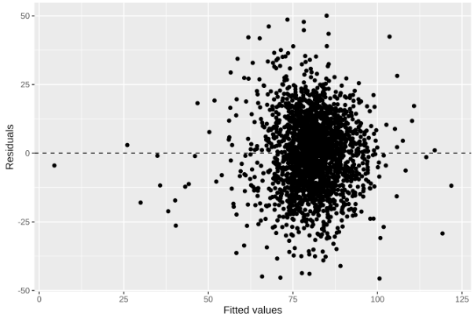

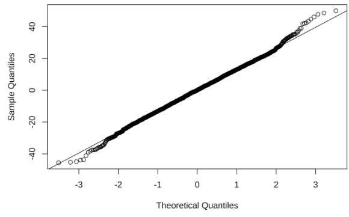

The fourth model utilized the RFE method on the log-transformed imputed dataset (see residual plots in `Figure 14` and `Figure 15`). Among the 4 models, this model performed the best, with an Adjusted R-squared of 32.01% and Residual Standard Error of 0.1823. Its F-statistic was 215.2, indicating that it is effective in its explanation of the variation in the dependent variable. The plots followed a similar pattern to the third model, showing slightly less clustering, a normal distribution in its histogram plot with its center near zero, and a slight left tail deviation in its QQ plot. 

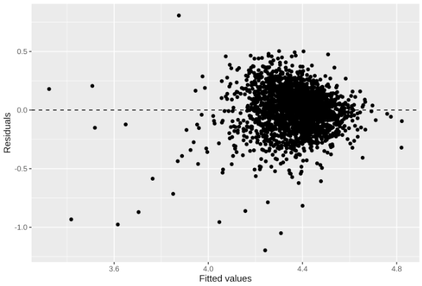

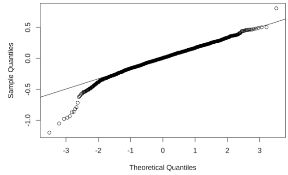

When comparing the models overall, a few observations stand out. Using the Recursive Feature elimination technique for feature selection produced higher Adjusted R-squared values and showed less heteroscedasticity in the Residual vs. Fitted Values plot. Additionally, using the log-transformed imputed training dataset produced a much lower Residual Standard Error than the non-transformed imputed dataset. When assessing the variables with negative coefficients, a few things should be considered. The variable TEAM_FIELDING_E had a negative coefficient in the third and fourth models, which means that when errors increase by 1, the number of wins will decrease, which makes sense since errors in a baseball game give the team hitting another opportunity to get a hit and drive in runs. 

# Model Selection

Below is a summary of the performance across our four models (`Figure 16`), where `m1` represents the model fit on untransformed variables using `findCorrelation` for feature selection, `m2` represents the model fit on log transformed variables with `findCorrelation`, `m3` represents the model fit on untransformed variables using RFE for feature selection, and `m4` represents the model trained with log transformed variables and RFE.

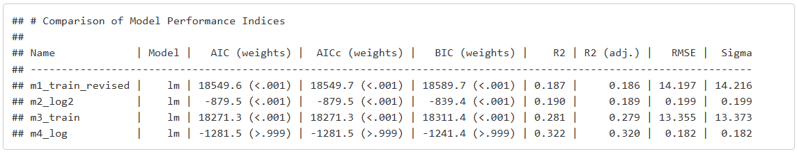

Based on the above, we chose the fourth model, `m4`, as our final model. First, it has the highest R-squared (0.322) and adjusted R-squared (0.320), indicating that it explains the most variance in the dependent variable compared to the other models. Moreover, it also has the lowest RMSE (0.182) and the lowest Sigma (0.182), suggesting better predictive accuracy and lower variability in the residuals. Even though the AIC and BIC are negative for the m4_log model, indicating that the model fits the data well, the weights for AIC and BIC (>0.999) show that this model is highly favored by these metrics over the others. A lower AIC/BIC is generally preferred for model selection. Finally, `m4` had the best diagnostics. It had the highest F-statistic value, and its residual plots indicated that it generally adheres to key assumptions for linear regression, namely homoscedasticity, constant variance, and normal distribution of errorss. 

We used this model to generate predictions, which we've included with this submission (`mlb_test_predictions.csv`). A key consideration for this model is ensuring that the features are all log transformed, as the model was trained with log transformed inputs. So, we made sure to log transform all the variables in the test subset before feeding them to the model for predictions. Moreover, we made sure to exponentiate the predicted wins to express them in the correct unit (rather than the transformed unit) in the final prediction dataframe.

\newpage

# Appendix

```{r ref.label=knitr::all_labels(), echo=TRUE, eval=FALSE}

## Config
library(tidyverse)
library(gtExtras)
library(vtable)
library(kableExtra)
library(reactable)
library(GGally)
library(corrplot)
library(corrr)
library(caret)
library(leaps)
library(MASS)
library(mice)
library(dlookr)
library(VIM)
library(performance)
library(ggcorrplot)
library(rsample)
library(skimr)
library(performance)
library(car)
library(caret)
library(olsrr)
library(DataExplorer)
library(vip)

## Data Exploration
mlb_training <- read.csv("https://raw.githubusercontent.com/moham6839/Data_621_HW1/main/moneyball-training-data.csv")

mlb_test <- read.csv("https://raw.githubusercontent.com/moham6839/Data_621_HW1/main/moneyball-evaluation-data.csv")

mlb_training <- mlb_training %>%
  dplyr::select(-INDEX)

mlb_test <- mlb_test %>%
  dplyr::select(-INDEX)

## Glimpse and Summary of MLB Training Set
head(mlb_training)

mlb_training %>%
  glimpse() %>%
  kable() %>%
  kable_styling()

mlb_training %>%
  summary() %>%
  kable() %>%
  kable_styling()

head(mlb_training)

### Glimpse and Summary of MLB Test Set
head(mlb_test)

mlb_test %>%
  glimpse() %>%
  kable() %>%
  kable_styling()

mlb_test %>%
  summary() %>%
  kable() %>%
  kable_styling()

head(mlb_test)

mlb_training %>%
  gather(variable, value, TARGET_WINS:TEAM_FIELDING_DP) %>%
  ggplot(., aes(value)) + 
  geom_density(fill = "blue", color="blue") + 
  facet_wrap(~variable, scales ="free", ncol = 4) +
  labs(x = element_blank(), y = element_blank())


ggplot(gather(mlb_training), aes(value)) + 
    geom_histogram(bins = 8) + 
    facet_wrap(~key, scales = 'free_x')


mlb_training %>% 
  ggplot(aes(TARGET_WINS)) + 
  geom_histogram(bins = 50, fill = 'blue', color="black",) +
  geom_vline(aes(xintercept = mean(TARGET_WINS, na.rm = T)), col = "red", lty = 2) +
  geom_vline(aes(xintercept = median(TARGET_WINS, na.rm = T)), col = "yellow", lty = 2) +
  labs(x = element_blank(),
       y = "Count",
       title = "Distribution of Wins",
       caption = "* Red line is the mean value and yellow is the median") + 
  theme_classic()

mlb_training %>%
  gather(-TARGET_WINS, key = "var", value = "value") %>% 
  ggplot(aes(x = value, y = TARGET_WINS)) +
    facet_wrap(~ var, scales = "free") +
    geom_point(fill = "blue", color="blue") +
    geom_smooth(method = "lm", se = FALSE, color = "black") + 
  labs(x = element_blank(), y = "Wins")

ggplot(stack(mlb_training), aes(x = ind, y = values)) +
  geom_boxplot() +
  coord_cartesian(ylim = c(0, 5000))+
  labs(x = element_blank(), y = element_blank()) +
  theme(axis.text.x = element_text(angle = 45, hjust = 1))

## Measuring Correlation of Features

cor_matrix <- mlb_training %>% 
  cor(., use = "complete.obs") 


ggcorrplot::ggcorrplot(cor_matrix, type = "lower",
          lab = TRUE, lab_size = 2.1, tl.cex = 8)

cor_matrix[lower.tri(cor_matrix, diag=TRUE)] <- ""
cor_matrix <- cor_matrix %>%
  as.data.frame() %>%
  rownames_to_column() %>%
  gather(Variable, Correlation, -rowname) %>%
  filter(Variable != rowname) %>%
  filter(Correlation != "") %>%
  mutate(Correlation = as.numeric(Correlation)) %>%
  rename(` Variable` = rowname) %>%
  arrange(desc(abs(Correlation))) 

cor_matrix %>%
  filter(abs(Correlation) > .5) %>%
  kable() %>%
  kable_styling()

**Missing Data**

mlb_training %>% 
  gather(variable, value) %>%
  filter(is.na(value)) %>%
  group_by(variable) %>%
  tally() %>%
  mutate(percent = n / nrow(mlb_training) * 100) %>%
  mutate(percent = paste0(round(percent, ifelse(percent < 10, 1, 0)), "%")) %>%
  arrange(desc(n)) %>%
  rename(`Variable Missing Data` = variable,
         `Number of Records` = n,
         `Share of Total` = percent) %>%
  kable(caption="<center>Missing Training Data Count and Percentage", align = "c") %>% 
  kable_styling(latex_options="scale_down", c("striped", "hover", "condensed", full_width=F))

mlb_test %>% 
  gather(variable, value) %>%
  filter(is.na(value)) %>%
  group_by(variable) %>%
  tally() %>%
  mutate(percent = n / nrow(mlb_test) * 100) %>%
  mutate(percent = paste0(round(percent, ifelse(percent < 10, 1, 0)), "%")) %>%
  arrange(desc(n)) %>%
  rename(`Variable Missing Data` = variable,
         `Number of Records` = n,
         `Share of Total` = percent) %>%
  kable(caption="<center>Missing Test Data Count and Percentage", align = "c") %>% 
  kable_styling(latex_options="scale_down", c("striped", "hover", "condensed", full_width=F))

### Flaws of Imputing `TEAM_BATTING_HBP`

set.seed(123)
mlb_train_imp2 <- mlb_training %>%
  kNN(variable = c("TEAM_BASERUN_CS", "TEAM_FIELDING_DP", "TEAM_BASERUN_SB", "TEAM_BATTING_SO", "TEAM_PITCHING_SO", "TEAM_BATTING_HBP"),
      k = 5, numFun = weighted.mean, weightDist = TRUE, imp_var = FALSE)

set.seed(123)
mlb_train_imp2 <- mlb_train_imp2 %>%
  dplyr::mutate(TEAM_BATTING_1B = TEAM_BATTING_H - dplyr::select(., TEAM_BATTING_2B:TEAM_BATTING_HR) %>% rowSums(na.rm = FALSE)) %>%
  dplyr::mutate(TEAM_BATTING_AB = TEAM_BATTING_H + TEAM_PITCHING_BB + TEAM_BATTING_SO + TEAM_BATTING_HBP) %>%
  dplyr::mutate(TEAM_BATTING_AVERAGE = TEAM_BATTING_H/TEAM_BATTING_AB) %>%
  dplyr::mutate(TEAM_BATTING_OBP = (TEAM_BATTING_H + TEAM_BATTING_BB + TEAM_BATTING_HBP)/(TEAM_BATTING_AB + TEAM_BATTING_BB + TEAM_BATTING_HBP)) %>%
  dplyr::mutate(TEAM_BATTING_SLG = (TEAM_BATTING_1B + 2*TEAM_BATTING_2B + 3*TEAM_BATTING_3B + 4*TEAM_BATTING_HR)/TEAM_BATTING_AB) %>%
  relocate(TEAM_BATTING_1B, .before = TEAM_BATTING_2B) 

head(mlb_train_imp2)

max(mlb_train_imp2$TEAM_BATTING_AVERAGE)

### Dropping `TEAM_BATTING_HBP` and Imputing Missing Values

## Training
set.seed(123)
mlb_training_no_hbp <- mlb_training %>%
  dplyr::select(-TEAM_BATTING_HBP)

set.seed(123)
mlb_train_imp <- mlb_training_no_hbp %>%
  kNN(variable = c("TEAM_BASERUN_CS", "TEAM_FIELDING_DP", "TEAM_BASERUN_SB", "TEAM_BATTING_SO", "TEAM_PITCHING_SO"),
      k = 5, numFun = weighted.mean, weightDist = TRUE, imp_var = FALSE)

head(mlb_train_imp)

sum(is.na(mlb_train_imp))
sum(is.nan(as.matrix(mlb_train_imp)))
sum(is.infinite(as.matrix(mlb_train_imp)))

### Test Set
set.seed(123)
mlb_test_no_hbp <- mlb_test %>%
  dplyr::select(-TEAM_BATTING_HBP)

set.seed(123)
mlb_test_imp <- mlb_test_no_hbp %>%
  kNN(variable = c("TEAM_BASERUN_CS", "TEAM_FIELDING_DP", "TEAM_BASERUN_SB", "TEAM_BATTING_SO", "TEAM_PITCHING_SO"),
      k = 5, numFun = weighted.mean, weightDist = TRUE, imp_var = FALSE)

head(mlb_test_imp)

sum(is.na(mlb_test_imp))
sum(is.nan(as.matrix(mlb_test_imp)))
sum(is.infinite(as.matrix(mlb_test_imp)))

## Data Preparation

mlb_train_imp <- mlb_train_imp %>%
  dplyr::mutate(TEAM_BATTING_1B = TEAM_BATTING_H - dplyr::select(., TEAM_BATTING_2B:TEAM_BATTING_HR) %>% rowSums(na.rm = FALSE)) %>%
  relocate(TEAM_BATTING_1B, .before = TEAM_BATTING_2B)

mlb_train_imp %>% 
  ggplot(aes(TEAM_BATTING_1B)) + 
  geom_histogram(bins = 50, fill = 'blue', color="black",) +
  geom_vline(aes(xintercept = mean(TEAM_BATTING_1B, na.rm = T)), col = "red", lty = 2) +
  geom_vline(aes(xintercept = median(TEAM_BATTING_1B, na.rm = T)), col = "yellow", lty = 2) +
  labs(x = element_blank(),
       y = "Count",
       title = "Distribution of Singles",
       caption = "* Red line is the mean value and yellow is the median") + 
  theme_classic()

cor_matrix2 <- mlb_train_imp %>% 
  cor(., use = "complete.obs") 

ggcorrplot::ggcorrplot(cor_matrix2, type = "lower",
          lab = TRUE, lab_size = 2.1, tl.cex = 8)

### Log-Transforming Variables

### Training Set

mlb_training_no_hbp <- mlb_training_no_hbp %>%
  dplyr::mutate(TEAM_BATTING_1B = TEAM_BATTING_H - dplyr::select(., TEAM_BATTING_2B:TEAM_BATTING_HR) %>% rowSums(na.rm = FALSE)) %>%
  relocate(TEAM_BATTING_1B, .before = TEAM_BATTING_2B)

mlb_train_log <- log(mlb_training_no_hbp)

set.seed(123)
mlb_train_log <- mlb_train_log%>%
  kNN(variable = c("TEAM_BASERUN_CS", "TEAM_FIELDING_DP", "TEAM_BASERUN_SB", "TEAM_BATTING_SO", "TEAM_PITCHING_SO"),
      k = 5, numFun = weighted.mean, weightDist = TRUE, imp_var = FALSE)

sum(is.na(mlb_train_log))
sum(is.nan(as.matrix(mlb_train_log)))
sum(is.infinite(as.matrix(mlb_train_log)))

mlb_train_log[sapply(mlb_train_log, is.infinite)] <- NA

set.seed(123)
mlb_train_log <- mlb_train_log %>%
  kNN(k = 5, numFun = weighted.mean, weightDist = TRUE, imp_var = FALSE)

mlb_train_log %>%
  gather(-TARGET_WINS, key = "var", value = "value") %>% 
  ggplot(aes(x = value, y = TARGET_WINS)) +
    facet_wrap(~ var, scales = "free") +
    geom_point(fill = "blue", color="blue") +
    geom_smooth(method = "lm", se = FALSE, color = "black") + 
  labs(x = element_blank(), y = "Wins")

ggplot(gather(mlb_train_log), aes(value)) + 
    geom_histogram(bins = 8) + 
    facet_wrap(~key, scales = 'free_x')

mlb_train_log %>%
  gather(variable, value, TARGET_WINS:TEAM_FIELDING_DP) %>%
  ggplot(., aes(value)) + 
  geom_density(fill = "blue", color="blue") + 
  facet_wrap(~variable, scales ="free", ncol = 4) +
  labs(x = element_blank(), y = element_blank())

**Test Set**

mlb_test_no_hbp <- mlb_test_no_hbp %>%
  dplyr::mutate(TEAM_BATTING_1B = TEAM_BATTING_H - dplyr::select(., TEAM_BATTING_2B:TEAM_BATTING_HR) %>% rowSums(na.rm = FALSE)) %>%
  relocate(TEAM_BATTING_1B, .before = TEAM_BATTING_2B)

mlb_test_log <- log(mlb_test_no_hbp)

set.seed(123)
mlb_test_log <- mlb_test_log%>%
  kNN(variable = c("TEAM_BASERUN_CS", "TEAM_FIELDING_DP", "TEAM_BASERUN_SB", "TEAM_BATTING_SO", "TEAM_PITCHING_SO"),
      k = 5, numFun = weighted.mean, weightDist = TRUE, imp_var = FALSE)

sum(is.na(mlb_test_log))
sum(is.nan(as.matrix(mlb_test_log)))
sum(is.infinite(as.matrix(mlb_test_log)))

mlb_test_log[sapply(mlb_test_log, is.infinite)] <- NA

set.seed(123)
mlb_test_log <- mlb_test_log %>%
  kNN(k = 5, numFun = weighted.mean, weightDist = TRUE, imp_var = FALSE)

sum(is.na(mlb_test_log))
sum(is.nan(as.matrix(mlb_test_log)))
sum(is.infinite(as.matrix(mlb_test_log)))

ggplot(gather(mlb_test_log), aes(value)) + 
    geom_histogram(bins = 10) + 
    facet_wrap(~key, scales = 'free_x')

## Model Building

### Model 1 - Using findCorrelation function from caret package

set.seed(123)
highlyCorDescr <- findCorrelation(cor(mlb_train_imp), cutoff = .50, verbose = TRUE, names=TRUE)

set.seed(123)
keep_these <- names(mlb_train_imp)[!(names(mlb_train_imp) %in% colnames(mlb_train_imp)[highlyCorDescr])]
mlb_train_features <- mlb_train_imp[, keep_these]

head(mlb_train_features)

set.seed(123)
m1 <- lm(TARGET_WINS ~., data = mlb_train_features)
summary(m1)

set.seed(123)
m1_train_revised <- lm(TARGET_WINS ~ TEAM_BATTING_2B + TEAM_BATTING_BB + TEAM_BASERUN_SB + TEAM_PITCHING_SO + TEAM_FIELDING_DP, data = mlb_train_features)
summary(m1_train_revised)

ggplot(m1_train_revised, aes(x = .fitted, y = .resid)) +
  geom_point() +
  geom_hline(yintercept = 0, linetype = "dashed") +
  labs(title="Residual vs. Fitted Values Plot") +
  xlab("Fitted values") +
  ylab("Residuals")

ggplot(data = m1_train_revised, aes(x = m1_train_revised$residuals)) +
    geom_histogram(bins = 10, fill = 'steelblue', color = 'black') +
    labs(title = 'Histogram of Residuals', x = 'Residuals', y = 'Frequency')

ggplot(data = m1_train_revised, aes(x = .resid)) +
  geom_histogram(binwidth = 0.4) +
  xlab("Residuals")

qqnorm(resid(m1_train_revised))
qqline(resid(m1_train_revised))

### Model 2 - Using findCorrelation function for Log-Transformed Train Set

set.seed(123)
highlyCorDescr2 <- findCorrelation(cor(mlb_train_log), cutoff = .50, verbose = TRUE)

set.seed(123)
keep_these2 <- names(mlb_train_log)[!(names(mlb_train_log) %in% colnames(mlb_train_log)[highlyCorDescr2])]
mlb_train_features2 <- mlb_train_log[, keep_these2]

head(mlb_train_features2)

set.seed(123)
m2_log <- lm(TARGET_WINS ~., data = mlb_train_features2)
summary(m2_log)

set.seed(123)
m2_log2 <- lm(TARGET_WINS ~ TEAM_BASERUN_SB + TEAM_BATTING_2B + TEAM_PITCHING_H + TEAM_PITCHING_BB + TEAM_PITCHING_SO, data = mlb_train_features2)
summary(m2_log2)

ggplot(m2_log2, aes(x = .fitted, y = .resid)) +
  geom_point() +
  geom_hline(yintercept = 0, linetype = "dashed") +
  labs(title="Residual vs. Fitted Values Plot") +
  xlab("Fitted values") +
  ylab("Residuals")

ggplot(data = m2_log2, aes(x = .resid)) +
  geom_histogram(binwidth = 0.04) +
  xlab("Residuals")

qqnorm(resid(m2_log2))
qqline(resid(m2_log2))

### Model 3 - Using Recursive Feature Elimination on Imputed Train Set

set.seed(123)
filterCtrl <- rfeControl(functions=rfFuncs, method="cv", number=3)
results <- rfe(x= mlb_train_imp[,2:16],y= mlb_train_imp[,1], sizes=c(2:16), rfeControl=filterCtrl)
results

set.seed(123)
m3_train <- lm(TARGET_WINS ~ TEAM_FIELDING_E + TEAM_BATTING_H + TEAM_BASERUN_CS + TEAM_BATTING_BB + TEAM_PITCHING_SO, data = mlb_train_imp)
summary(m3_train)

ggplot(m3_train, aes(x = .fitted, y = .resid)) +
  geom_point() +
  geom_hline(yintercept = 0, linetype = "dashed") +
  labs(title="Residual vs. Fitted Values Plot") +
  xlab("Fitted values") +
  ylab("Residuals")

ggplot(data = m3_train, aes(x = m3_train$residuals)) +
    geom_histogram(bins = 10, fill = 'steelblue', color = 'black') +
    labs(title = 'Histogram of Residuals', x = 'Residuals', y = 'Frequency')

ggplot(data = m3_train, aes(x = .resid)) +
  geom_histogram(binwidth = 0.4) +
  xlab("Residuals")

qqnorm(resid(m3_train))
qqline(resid(m3_train))

### Model 4 - Using Recursive Feature Elimination for Log-Transformed Imputed Train Set

set.seed(123)
filterCtrl2 <- rfeControl(functions=rfFuncs, method="cv", number=3)
results2 <- rfe(x= mlb_train_log[,2:16],y= mlb_train_log[,1], sizes=c(2:16), rfeControl=filterCtrl2)
results2

set.seed(123)
m4_log <- lm(TARGET_WINS ~ TEAM_FIELDING_E + TEAM_BATTING_H + TEAM_BASERUN_SB + TEAM_PITCHING_SO + TEAM_BATTING_BB, data=mlb_train_log)
summary(m4_log)

set.seed(123)
vip(m4_log)

ggplot(m4_log, aes(x = .fitted, y = .resid)) +
  geom_point() +
  geom_hline(yintercept = 0, linetype = "dashed") +
  labs(title="Residual vs. Fitted Values Plot") +
  xlab("Fitted values") +
  ylab("Residuals")

ggplot(data = m4_log, aes(x = m4_log$residuals)) +
    geom_histogram(bins = 10, fill = 'steelblue', color = 'black') +
    labs(title = 'Histogram of Residuals', x = 'Residuals', y = 'Frequency')

ggplot(data = m4_log, aes(x = .resid)) +
  geom_histogram(binwidth = 0.2) +
  xlab("Residuals")

qqnorm(resid(m4_log))
qqline(resid(m4_log))

## Model Selection
set.seed(123)
compare_performance(m1_train_revised, m2_log2, m3_train, m4_log)

set.seed(123)
predictions <- predict(m4_log, newdata = mlb_test_log)
summary(predictions)

set.seed(123)
mlb_test_log$predicted_wins <- round(exp(predictions))

set.seed(123)
mlb_test_log_final <- mlb_test_log %>%
  relocate(predicted_wins) 

head(mlb_test_log_final)
```

## References 


* [Masterindatascience Link](https://www.mastersindatascience.org/learnig/how-to-deal-with-missing-data/#:~:text=When%20dealing%20with%20missing%20data,be%20required%2C%20even%20if%20incomplete)

* [Stefvanbuuren Link](https://stefvanbuuren.name/fimd/sec-MCAR.html)

* [Analyticsvidhya Link](https://www.analyticsvidhya.com/blog/2021/10/handling-missing-value/#:~:text=Generally%2C%20this%20approach%20is%20not,useful%20data%20from%20the%20dataset)

* [Datacamp Link](https://campus.datacamp.com/courses/handling-missing-data-with-imputations-in-r/donor-based-imputation?ex=9)

* [Statmuse Link](https://www.statmuse.com/mlb/ask/which-team-has-the-highest-batting-average-in-a-season)

* [JTF13 Github Link](https://jtr13.github.io/cc21fall2/feature-selection-in-r.html)

* [Sthda Link](http://www.sthda.com/english/articles/37-model-selection-essentials-in-r/154-stepwise-regression-essentials-in-r/#google_vignette)

* [Bookdown Link](https://www.bookdown.org/rwnahhas/RMPH/mi-fitting.html)


